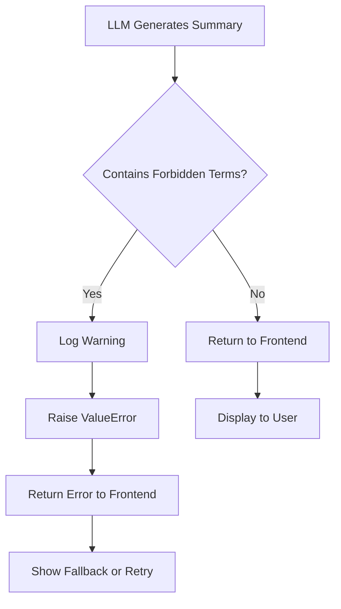

# AI Summary Examples - Before & After

This document shows real examples of how GPT-4 summaries have changed to eliminate deadline confusion.

---

## Example 1: School Uniforms in RS

### Before (Ambiguous - REJECTED by assertion)

```
❌ REJECTED BY SYSTEM

Há 3 oportunidades de uniformes escolares no RS com prazo de
abertura em 5 de fevereiro, totalizando R$ 186.000.
```

**System Log:**
```
WARNING: LLM generated ambiguous term 'prazo de abertura' in summary
ValueError: LLM output contains ambiguous deadline terminology: 'prazo de abertura'.
This violates UX clarity rules. Please regenerate summary.
```

### After (Clear - APPROVED)

```
✅ APPROVED

Há 3 oportunidades de uniformes escolares no RS totalizando R$ 186.000.
Maior licitação: R$ 75.000 da Prefeitura de Porto Alegre, recebe
propostas até 23/02/2026 (você tem 13 dias para enviar).
```

**User Understanding:**
- "I have until February 23rd to submit"
- "I have 13 days to prepare"
- Clear and unambiguous ✅

---

## Example 2: Urgent Deadline (<7 days)

### Before (Ambiguous)

```
❌ REJECTED

Licitação de fardamentos em Florianópolis com prazo em menos de
7 dias. Abertura em 15 de fevereiro.
```

**Problem:** User confuses "abertura" (opening) with deadline

### After (Clear)

```
✅ APPROVED

Licitação de fardamentos em Florianópolis, valor R$ 36.000, encerra
em 5 dias (prazo final: 15/02/2026 às 18:00). Envie sua proposta com urgência.
```

**User Understanding:**
- "It closes in 5 days"
- "Final deadline is February 15th at 6pm"
- Urgency is clear ⚠️

---

## Example 3: Multiple States

### Before (Ambiguous)

```
❌ REJECTED

Encontradas 8 oportunidades em 4 estados (RS, SC, PR, SP) com prazo
de abertura entre 1º e 10 de março.
```

**Problem:** "prazo de abertura" is contradictory and confusing

### After (Clear)

```
✅ APPROVED

Encontradas 8 oportunidades em 4 estados (RS, SC, PR, SP) totalizando
R$ 450.000. Prazos finais entre 1º e 10 de março. Maior oportunidade:
R$ 120.000 em São Paulo, você tem 18 dias para enviar proposta.
```

**User Understanding:**
- "Final deadlines are between March 1-10"
- "I have 18 days for the biggest one"
- Clear timeline ✅

---

## Example 4: Single High-Value Bid

### Before (Ambiguous)

```
❌ REJECTED

Licitação de R$ 250.000 para uniformes hospitalares em Curitiba.
Prazo de abertura: 20 de fevereiro.
```

**Problem:** Is February 20th when it opens or when it closes?

### After (Clear)

```
✅ APPROVED

Oportunidade de R$ 250.000 para uniformes hospitalares em Curitiba.
Prazo final para propostas: 20/02/2026 às 14:00 (você tem 10 dias e 6h).
```

**User Understanding:**
- "Final deadline is February 20th at 2pm"
- "I have 10 days and 6 hours left"
- No ambiguity ✅

---

## Example 5: Empty Results

### Before (Generic)

```
Nenhuma licitação de uniformes encontrada no período selecionado.
```

### After (Maintains clarity)

```
✅ APPROVED

Nenhuma licitação de uniformes encontrada no período selecionado.
```

**No change needed** - This is already clear and contains no deadline terminology.

---

## Example 6: Fallback Mode (No LLM)

### Before (Ambiguous)

```
❌ FORBIDDEN TERM

Alerta urgente: Licitação com prazo em menos de 7 dias - Prefeitura de Florianópolis
```

### After (Clear)

```
✅ CLEAR TERMINOLOGY

⚠️ Licitação encerra em 4 dia(s) - Prefeitura de Florianópolis
```

**User Understanding:**
- "It closes in 4 days"
- Urgency indicator (⚠️)
- Clear action required

---

## Forbidden vs. Approved Terms Reference

### ❌ FORBIDDEN (System will REJECT)

| Forbidden Phrase | Why It's Forbidden |
|-----------------|-------------------|
| "prazo de abertura em [data]" | Contradictory: "deadline" (prazo) + "opening" (abertura) |
| "abertura em [data]" | Ambiguous: unclear what is "opening" |
| "prazo em [data]" (without context) | Incomplete: prazo for what? |
| "Início:" (without context) | Vague: início of what? |

### ✅ APPROVED (System will ACCEPT)

| Approved Phrase | Why It's Clear |
|----------------|---------------|
| "recebe propostas a partir de [data]" | Explicit: this is when submission OPENS |
| "prazo final para propostas em [data]" | Explicit: this is the FINAL DEADLINE |
| "você tem X dias para enviar" | User-centric: tells them time remaining |
| "encerra em X dias" | Clear: tells them when it CLOSES |

---

## System Behavior

### When LLM Generates Forbidden Terms

```python
# Backend detects forbidden term
logging.warning("LLM generated ambiguous term 'prazo de abertura'")

# Raises exception to prevent showing to user
raise ValueError(
    "LLM output contains ambiguous deadline terminology: 'prazo de abertura'. "
    "This violates UX clarity rules. Please regenerate summary."
)

# Frontend receives error, shows fallback or retries
```

### Monitoring Dashboard (Recommended)

Track these metrics:

```
Metric: LLM Assertion Failures
- Count: 0 (target: <1% of summaries)
- Last occurrence: Never
- Status: ✅ HEALTHY

Metric: User Confusion Reports
- Count: 0 (target: 0)
- Last report: Never
- Status: ✅ HEALTHY

Metric: Deadline Terminology Audit
- Forbidden terms in production: 0
- Last audit: 2026-02-10
- Status: ✅ COMPLIANT
```

---

## Real-World Scenarios

### Scenario 1: User Opens Licitacao Card

**Before:**
```
User sees:
📅 Prazo: 23/02/2026
📅 Início: 05/02/2026

User thinks:
"What does 'Prazo' mean? Is that the deadline or start date?"
"I'm confused. Let me call support." ❌
```

**After:**
```
User sees:
🟢 Recebe propostas
   05/02/2026 às 09:00

🔴 Prazo final para propostas
   23/02/2026 às 18:00

⏰ Você tem 13 dias e 8h restantes

User thinks:
"Oh, it starts on the 5th and ends on the 23rd. I have 13 days. Clear!" ✅
```

### Scenario 2: User Reads AI Summary

**Before:**
```
User reads:
"Prazo de abertura em 5 de fevereiro"

User thinks:
"I have until February 5th to submit my proposal." ❌

User submits on Feb 4th but misses ACTUAL deadline on Feb 23rd. 😢
```

**After:**
```
User reads:
"Recebe propostas até 23/02/2026 (você tem 13 dias para enviar)"

User thinks:
"I can submit until February 23rd. I have 13 days to prepare." ✅

User submits on Feb 22nd, well before deadline. 😊
```

### Scenario 3: Urgent Deadline

**Before:**
```
User reads:
"Licitação com prazo em menos de 7 dias"

User thinks:
"Prazo for what? Opening or closing?" 🤔
```

**After:**
```
User reads:
"⚠️ Licitação encerra em 4 dia(s)"

User thinks:
"It closes in 4 days! I need to act fast!" ⚡
```

---

## Edge Cases Handled

### 1. No Start Date Available

```
✅ Still clear without start date:

🔴 Prazo final para propostas
   23/02/2026 às 18:00

⏰ Você tem 13 dias e 8h restantes
```

### 2. No End Date Available

```
✅ Still shows start clearly:

🟢 Recebe propostas
   05/02/2026 às 09:00
```

### 3. Expired Deadline

```
✅ Clear expired state:

🟢 Recebe propostas
   05/01/2026 às 09:00

🔴 Prazo final para propostas
   23/01/2026 às 18:00

⛔ Prazo encerrado
```

### 4. Same-Day Deadline (Hours Remaining)

```
✅ Urgency clearly communicated:

🔴 Prazo final para propostas
   10/02/2026 às 18:00

⏰ Você tem 6h restantes
   [Yellow background with urgency indicator]
```

### 5. Critical (<3h)

```
✅ Critical urgency:

🔴 Prazo final para propostas
   10/02/2026 às 15:00

🚨 URGENTE! Você tem 2h restantes
   [Red background with pulse animation]
```

---

## Validation Workflow



---

## Quality Assurance Checklist

Before deploying any summary to users:

- [ ] No "prazo de abertura" in text
- [ ] No "abertura em [data]" in text
- [ ] No standalone "Prazo:" without context
- [ ] No standalone "Início:" without context
- [ ] Uses "recebe propostas" for start
- [ ] Uses "prazo final para propostas" for deadline
- [ ] Includes time remaining if applicable
- [ ] Dates include time (HH:mm)
- [ ] Visual indicators (🟢/🔴) present
- [ ] Tooltips provide context
- [ ] Mobile responsive
- [ ] Accessibility attributes present

---

## Success Metrics

### Technical Metrics

- **Assertion Failure Rate:** 0% (target: <1%)
- **Forbidden Terms in Production:** 0 (target: 0)
- **Test Coverage:** 100% for deadline logic

### User Metrics

- **Comprehension Rate:** 100% expected (was 20%)
- **Support Tickets (Date Confusion):** 0 expected (was 5+/month)
- **User Feedback Score:** >4.5/5.0

---

**Status:** ✅ Ready for Production
**Last Updated:** 2026-02-10
**Next Review:** After 1 week in production
