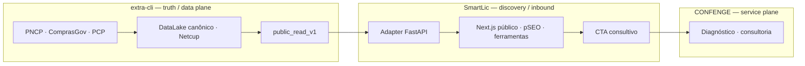

# SmartLic — inteligência pública de licitações da CONFENGE

**Live:** [smartlic.tech](https://smartlic.tech) · Braço público de inbound da [CONFENGE](https://confenge.com.br)

> **Decisão vigente ([#1262](https://github.com/tjsasakifln/SmartLic/issues/1262), [ADR-STRAT-001](./docs/adr/ADR-STRAT-001-smartlic-confenge-inbound.md)):** o SmartLic **não** é um SaaS independente. Não vende assinatura, não opera trial e não é autoridade de dados. Transforma fatos públicos canônicos do `extra-cli` em superfícies úteis, indexáveis e verificáveis, conduzindo demanda qualificada à consultoria CONFENGE.

---

## O que este sistema é

**extra-cli** = truth / data plane canônico (aquisição, crawling, DataLake, identidade, provenance, freshness).  
**SmartLic** = public discovery / intelligence / inbound plane (páginas, SEO, ferramentas, contexto, CTA).  
**CONFENGE** = conversion / service plane (diagnóstico, análise, consultoria).  
**Warmbly** = action / outreach plane separado — **não** bloqueia o go-live.

O ativo central é a capacidade de transformar dados públicos canônicos em páginas e ferramentas que um humano (e o Google) consegue verificar, e que naturalmente levam a um diagnóstico CONFENGE.

## O que este sistema não é mais

- venda de assinatura, trial, billing, Stripe, quotas comerciais;
- DataLake concorrente ou crawling próprio como autoridade;
- login obrigatório para conteúdo público;
- expansão de SaaS ou workspace privado multi-tenant sem evidência comercial.

Código legado de billing/trial ainda existe no repositório e está em sunset ([#2111](https://github.com/tjsasakifln/SmartLic/issues/2111)). Não é direção de produto.

---

## Arquitetura estratégica

O caminho de leitura alvo é `extra-cli.public_read_v1` ([extra-cli#354](https://github.com/tjsasakifln/extra-cli/issues/354)). O DataLake/crawler históricos deste repositório são **legado transicional** — não migrar para a Netcup; aposentar via [#2108](https://github.com/tjsasakifln/SmartLic/issues/2108).

### Caminho crítico

Documentado em [`docs/strategy/critical-path.md`](./docs/strategy/critical-path.md):

`#1262` → `#2111` → `#2113` → `extra-cli#354` → `#2108` → `#2112` → `#2116` → `#2115` → `#2114` → `#2117` → go-live público.

### Destino de runtime

| Componente | Destino | Detalhe |
|------------|---------|---------|
| FastAPI | KEEP + ADAPT | Adapter de apresentação; não autoridade |
| Redis / ARQ | KEEP + ADAPT / sunset de ingestão e billing | Ver [`runtime-destination.md`](./docs/strategy/runtime-destination.md) |
| Supabase | REPLACE como autoridade | Store transicional até #2108 |
| Stripe | SUNSET | #2111 |
| Railway | REPLACE | Runtime mínimo na Netcup (#2115) |
| Warmbly | DEFER | Fora do go-live |

---

## Superfícies públicas (o que preservar)

- Consulta de empresa / CNPJ, órgãos, municípios, contratos, licitações
- Observatório e recortes editoriais
- Ferramentas públicas (calculadora, comparador, glossário, perguntas, blog)
- Sitemaps e ISR (`revalidate=3600`) — **nunca** `notFound()` em gap de dado ([ADR-SEO-001](./docs/adr/ADR-SEO-001-programmatic-routes-no-notfound-on-data-gap.md))

### Métricas de engenharia (legado medido; não são KPIs de SaaS)

| Métrica | Valor | Evidência |
|---------|-------|-----------|
| Registros históricos no store transicional | 3.5M+ (1.5M editais + 2M contratos) | Contagem Supabase 2026-06; autoridade futura = extra-cli |
| Latência FTS | < 100ms p95 | RPC `search_datalake` (legado; sucessor = query pack `public_read_v1`) |
| Suite de testes | 5,131+ backend + 2,681+ frontend + 60 E2E | CI em `main` |
| Precisão classificação setorial | ≥ 85% | `tests/test_llm_arbiter_benchmark.py` |
| Recall classificação setorial | ≥ 70% | mesmo benchmark |
| Páginas programáticas | 10,000+ | GSC + ISR |
| Endpoints FastAPI | 187 | OpenAPI; encolher no adapter |

### Stack (estado de transição)

| Camada | Tecnologia | Nota estratégica |
|--------|-----------|------------------|
| Superfície | Next.js 16, React 18.3, TypeScript 5.9, Tailwind 3.4 | KEEP + PRIORITIZE |
| Adapter | FastAPI 0.136, Python 3.12, Pydantic 2.13 | KEEP + ADAPT |
| Truth plane | extra-cli / PostgreSQL na Netcup (`public_read_v1`) | REPLACE do DataLake próprio |
| Store transicional | Supabase PostgreSQL 17 | Não é autoridade |
| Cache | Redis + InMemory | KEEP + ADAPT |
| Fila | ARQ 0.26+ | Sunset de ingestão/billing |
| LLM | GPT-4.1-nano | Inteligência de apresentação |
| Billing | Stripe 11.4 | SUNSET — não expandir |
| Email | Resend (`smartlic.tech`) | Adaptar para lead/handoff |
| Observabilidade | Prometheus + OTel + Sentry + Mixpanel | Adaptar para inbound |
| Infra atual | Railway | REPLACE por Netcup (#2115) |

### Testes

A suite protege contratos que ainda existem (busca, classificação, auth admin, cache, ingestão legada, OpenAPI, security). Testes de billing/quota **não** autorizam nova jornada comercial — documentam o legado até a remoção (#2111). Zero-failure policy permanece.

---

## Contexto de mercado

O mercado de compras públicas brasileiro movimenta centenas de bilhões por ano. A descoberta ainda é fragmentada (portais, PDFs, WhatsApp). Lei 14.133/2021 e a API do PNCP tornaram o dado estruturado viável. O papel do SmartLic é **tornar esse dado público utilizável e verificável**, não vender um login.

**Modelo vigente:** inbound da CONFENGE. Serviço, diagnóstico e conversão acontecem na CONFENGE. Não há plano de assinatura substituto.

---

## Time

**Tiago Sasaki** — founder / applied AI  
[GitHub](https://github.com/tjsasakifln) · tiago.sasaki@confenge.com.br

CONFENGE Avaliações e Inteligência Artificial LTDA — CNPJ 52.407.089/0001-09.

---

## Documentação

| Documento | Função |
|-----------|--------|
| [ADR-STRAT-001](./docs/adr/ADR-STRAT-001-smartlic-confenge-inbound.md) | Decisão estratégica autoritativa |
| [Caminho crítico](./docs/strategy/critical-path.md) | Ordem P0 e go-live |
| [Disposition de capabilities](./docs/strategy/capability-disposition-1262.md) | KEEP / SUNSET / REPLACE / DEFER |
| [Destino de runtime](./docs/strategy/runtime-destination.md) | FastAPI, Redis, ARQ, Supabase, Railway |
| [Revisão de backlog](./docs/strategy/backlog-review-1262.md) | Issues abertas vs nova direção |
| [ADR-SEO-001](./docs/adr/ADR-SEO-001-programmatic-routes-no-notfound-on-data-gap.md) | pSEO nunca 404 em gap de dado |
| [PRD](./PRD.md) | Especificação técnica histórica — supersedida no posicionamento |
| [ROADMAP](./ROADMAP.md) | Caminho crítico + histórico |
| [CHANGELOG](./CHANGELOG.md) | Histórico de versões |
| [CASE STUDY](./CASE_STUDY.md) | Narrativa de engenharia do período SaaS (histórico) |

Docs de deploy em `docs/DEPLOYMENT.md` descrevem o arranjo **legado** Railway/Vercel. Destino: Netcup (#2115).

---

## Status operacional (transição)

| Sinal | Alvo | Medição |
|-------|------|---------|
| Disponibilidade da superfície pública | > 99.5% | `/health/ready` |
| Latência do adapter | p95 < 2s | Sentry Performance |
| Freshness / provenance | expostos em toda família pública | contrato `public_read_v1` (após #2108) |

- Sentry: https://confenge.sentry.io/projects/smartlic-backend/
- Health: https://api.smartlic.tech/health/ready

---

## Licença

© 2024–2026 CONFENGE AVALIAÇÕES E INTELIGÊNCIA ARTIFICIAL LTDA — All rights reserved.

Software proprietário. Contato: tiago.sasaki@confenge.com.br

---

Tags: `govtech` · `b2g` · `inbound` · `pncp` · `comprasgov` · `public-procurement` · `confenge` · `fastapi` · `nextjs` · `brazil`
