# Technical Debt Assessment - DRAFT

**Data:** 2026-03-23 | **Consolidado por:** @architect (Aria) — Brownfield Discovery Phase 4
**Status:** DRAFT — Pendente revisao dos especialistas

---

## 1. Resumo Executivo

| Metrica | Valor |
|---------|-------|
| **Total de debitos** | 56 |
| **CRITICAL** | 2 |
| **HIGH** | 12 |
| **MEDIUM** | 25 |
| **LOW** | 17 |
| **Esforco total estimado** | ~246h |
| **Distribuicao** | Sistema: ~84h / Database: ~4h / Frontend: ~88h / Cross-cutting: ~70h |

### Top 10 Itens Mais Urgentes

| # | ID | Debito | Severidade | Area | Horas |
|---|-----|--------|-----------|------|-------|
| 1 | DB-C01 | 3 tabelas FK para auth.users ao inves de profiles | CRITICAL | Database | 0.5 |
| 2 | DEBT-323 | `_plan_status_cache` unbounded dict (memory leak) | CRITICAL | Backend | 1 |
| 3 | TD-H01 | Zero Server Components — todas as paginas "use client" | HIGH | Frontend | 16 |
| 4 | TD-H03 | Sem `aria-live` para SSE updates (WCAG 4.1.3) | HIGH | Frontend | 6 |
| 5 | TD-H04 | Pipeline kanban sem keyboard DnD / screen reader | HIGH | Frontend | 8 |
| 6 | DEBT-307 | Stripe webhook handler 1192 LOC monolitico | HIGH | Backend | 6 |
| 7 | DEBT-301 | filter.py 3871 LOC — maior arquivo do backend | HIGH | Backend | 8 |
| 8 | DEBT-324 | Dual Stripe webhook router registration | HIGH | Backend | 1 |
| 9 | DB-H01 | RLS usa auth.role() em 6 policies (pattern deprecated) | HIGH | Database | 0.33 |
| 10 | DB-H04 | Missing NOT NULL em created_at/updated_at | HIGH | Database | 0.25 |

---

## 2. Debitos de Sistema (da system-architecture.md)

Revisado por @architect (auto-review)

### CRITICAL

| ID | Debito | Esforco | Impacto | Descricao |
|----|--------|---------|---------|-----------|
| DEBT-323 | `_plan_status_cache` unbounded | 1h | Seguranca/Memoria | `quota.py:44` — dict cresce sem limite. Diferente de `_token_cache` (LRU 1000) e `_arbiter_cache` (LRU 5000). Pode causar OOM sob alto volume de usuarios. |

### HIGH

| ID | Debito | Esforco | Impacto | Descricao |
|----|--------|---------|---------|-----------|
| DEBT-301 | filter.py monolitico (3871 LOC) | 8h | Manutencao | Maior arquivo apesar de 11 submodules existirem. Core matching deveria ser migrado. |
| DEBT-302 | schemas.py monolitico (2121 LOC) | 6h | Manutencao | Todos os Pydantic models de 126 endpoints em um arquivo. |
| DEBT-305 | job_queue.py (2152) + cron_jobs.py (2039) | 6h | Manutencao | Monolitos de jobs/crons. |
| DEBT-307 | Stripe webhooks monolitico (1192 LOC) | 6h | Seguranca | 10+ event types em uma handler function. Dificil auditar logica de billing. |
| DEBT-324 | Dual Stripe webhook router | 1h | Seguranca | `startup/routes.py:62+70` — registra router em `/v1/` E root. Possivel double-processing. |
| DEBT-304 | 69 top-level .py files | 12h | Onboarding | Faltam packages para filtering (11), search (4), PNCP (3). |

### MEDIUM

| ID | Debito | Esforco | Impacto | Descricao |
|----|--------|---------|---------|-----------|
| DEBT-303 | pncp_client.py sync + async dual | 4h | Performance | Importa `requests` junto com `httpx`. Fallback via `asyncio.to_thread()`. |
| DEBT-306 | search_cache.py (2512 LOC) | 4h | Manutencao | L1, L2, SWR, key gen, serialization em um arquivo. |
| DEBT-309 | quota.py (1622 LOC) mixed concerns | 4h | Manutencao | Plan definition + quota + rate limiting + trial em um modulo. |
| DEBT-310 | main.py backward-compat re-exports | 3h | Manutencao | ~75 linhas de proxy classes para testes. |
| DEBT-312 | filter_*.py naming ambiguity | 3h | Manutencao | 11 filter files + filter.py com docstring enganosa. |
| DEBT-313 | ComprasGov v3 dead source | 2h | Performance | Fonte fora do ar desde marco 2026. Timeout budget desperdicado. |
| DEBT-314 | 40+ feature flags, possiveis dead flags | 3h | Manutencao | `config/features.py` — flags que podem ser permanentes. |
| DEBT-315 | 58 API proxies, nem todos usam factory | 4h | Manutencao | `create-proxy-route.ts` existe mas nao e universal. |
| DEBT-316 | Onboarding (783) + signup (703) LOC | 4h | Manutencao | Paginas grandes sem decomposicao de componentes. |
| DEBT-317 | clients/ inconsistente | 4h | Manutencao | 5 clients com estrutura variada apesar de `base.py` existir. |
| DEBT-322 | CB configs mislocated | 1h | Manutencao | PCP/ComprasGov circuit breaker configs em `pncp_client.py:56-71`. |
| DEBT-325 | Hardcoded USD_TO_BRL = 5.0 | 0.5h | Manutencao | `llm_arbiter.py:73` — cost tracking impreciso. |

### LOW

| ID | Debito | Esforco | Impacto | Descricao |
|----|--------|---------|---------|-----------|
| DEBT-308 | api-types.generated.ts (5177 LOC) | 2h | Performance | Verificar tree-shaking. |
| DEBT-311 | Test LOC 1.8x source | 8h audit | Manutencao | Possivel duplicacao ou over-specification. |
| DEBT-318 | docs/ content currency unknown | 2h audit | Manutencao | Documentacao potencialmente stale. |
| DEBT-319 | scripts/ fora do CI | 2h | Qualidade | 12 utility scripts sem validacao em CI. |
| DEBT-320 | startup/ compat shim | 1h | Manutencao | `main.py:82-102` track_legacy_routes() duplica logica. |
| DEBT-321 | blog.ts hardcoded (785 LOC) | N/A | Design choice | Conteudo do blog estatico no codigo. |

---

## 3. Debitos de Database (do DB-AUDIT.md)

PENDENTE: Revisao do @data-engineer

### CRITICAL

| ID | Debito | Esforco | Impacto | Descricao |
|----|--------|---------|---------|-----------|
| DB-C01 | 3 tabelas FK para auth.users | 0.5h | Integridade | `search_results_store`, `mfa_recovery_codes`, `mfa_recovery_attempts`. Profile deletion orphana rows. Fix: NOT VALID + VALIDATE pattern (ja usado em 10+ tabelas). |

### HIGH

| ID | Debito | Esforco | Impacto | Descricao |
|----|--------|---------|---------|-----------|
| DB-H01 | auth.role() em 6 RLS policies | 0.33h | Seguranca | Pattern deprecated em `organizations`, `organization_members`, `partners`, `partner_referrals`, `reconciliation_log`, `search_results_store`. |
| DB-H02 | health/incidents sem user RLS | 0.25h | Seguranca | So service_role pode ler. Futuro status page ficaria bloqueado. |
| DB-H03 | 3 duplicate updated_at functions | 0.33h | Manutencao | `pipeline_items`, `alert_preferences`, `alerts` usam funcoes proprias ao inves de `set_updated_at()`. |
| DB-H04 | Missing NOT NULL em created_at | 0.25h | Integridade | `classification_feedback`, `user_oauth_tokens` — INSERT com NULL quebraria ORDER BY e pg_cron. |

### MEDIUM

| ID | Debito | Esforco | Impacto | Descricao |
|----|--------|---------|---------|-----------|
| DB-M02 | organizations.owner_id FK design | 0.5h | Manutencao | ON DELETE RESTRICT para auth.users (intencional mas inconsistente com padrao profiles). |
| DB-M03 | partner_referrals FK behavior | 0.5h | Integridade | Verificar se CASCADE vs SET NULL esta correto apos DEBT-104. |
| DB-M04 | Sem CHECK em response_state | 0.17h | Integridade | search_sessions aceita qualquer string. |
| DB-M05 | Sem CHECK em pipeline_stage | 0.17h | Integridade | search_sessions aceita qualquer string. |
| DB-M07 | subscription_status enum mapping docs | 0.17h | Manutencao | profiles vs user_subscriptions usam valores diferentes. Trigger existe mas undocumented. |

### LOW

| ID | Debito | Esforco | Impacto | Descricao |
|----|--------|---------|---------|-----------|
| DB-L01 | Migration naming inconsistency | 0.08h | Manutencao | Dois padroes: sequential + timestamp. `.bak` file no diretorio. |
| DB-L02 | Redundant update_updated_at() | 0.17h | Manutencao | Pode co-existir com set_updated_at() sem dependentes. |
| DB-L03 | Missing COMMENTs em tabelas antigas | 0.25h | Manutencao | profiles, user_subscriptions, etc. sem COMMENT. |
| DB-L04 | alert_runs RLS granularity | Futuro | Performance | Correlated subquery pode ficar lento em >10K rows. |
| DB-L05 | Cache cleanup limit 5 vs 10 | 0.17h | Performance | debt017 reverteu de 10 para 5. Pode evictar hot entries prematuramente. |

---

## 4. Debitos de Frontend/UX (do frontend-spec.md)

PENDENTE: Revisao do @ux-design-expert

### HIGH

| ID | Debito | Esforco | Impacto | Descricao |
|----|--------|---------|---------|-----------|
| TD-H01 | Zero Server Components | 16h | Performance/SEO | Todas as paginas "use client". Landing, blog, legal, pricing deveriam ser RSC. ~40% TTFB improvement esperado. |
| TD-H02 | Dual header/auth pattern | 4h | Manutencao | `/buscar` bypassa `(protected)/layout.tsx`. Logica duplicada, UI inconsistente. |
| TD-H03 | Sem `aria-live` para SSE | 6h | Acessibilidade | Progresso de busca e resultados invisiveis para screen readers. WCAG 4.1.3. |
| TD-H04 | Pipeline kanban sem keyboard DnD | 8h | Acessibilidade | Sem drag via teclado, sem anuncios de screen reader para moves. |

### MEDIUM

| ID | Debito | Esforco | Impacto | Descricao |
|----|--------|---------|---------|-----------|
| TD-M01 | 22 `any` types em 15 arquivos | 4h | Type Safety | SavedSearchesDropdown, OrgaoFilter, MunicipioFilter, AnalyticsProvider, LoginForm, ErrorDetail. |
| TD-M02 | ValorFilter.tsx (478 LOC) | 3h | Manutencao | Mixing currency formatting + dual-slider + presets. |
| TD-M03 | EnhancedLoadingProgress (391 LOC) | 3h | Manutencao | Multi-phase loading + UF grid + fallback em um componente. |
| TD-M04 | useFeatureFlags custom cache | 2h | Manutencao | Implementa cache proprio ao inves de usar SWR (ja disponivel). |
| TD-M05 | Raw CSS var usage (~40 instancias) | 3h | Manutencao | `bg-[var(--surface-0)]` ao inves de `bg-surface-0`. Quebra Tailwind intellisense. |
| TD-M06 | 87 localStorage sem registry | 2h | Manutencao | Sem constantes centralizadas. Risco de colisao. |
| TD-M07 | Landing fully client-rendered | 8h | Performance | 13 componentes estaticos forcados a client por Framer Motion. |
| TD-M08 | ProfileCompletionPrompt (21KB) | 3h | Manutencao | Componente muito grande precisa decomposicao. |
| TD-M09 | Feature-gated pages routable | 2h | UX | `/alertas`, `/mensagens` acessiveis por URL mas API retorna 404. |

### LOW

| ID | Debito | Esforco | Impacto | Descricao |
|----|--------|---------|---------|-----------|
| TD-L01 | Sem a11y unit tests | 4h | Acessibilidade | Sem jest-axe. So 2 Playwright axe-core E2E specs. |
| TD-L02 | Skeleton coverage gaps | 4h | UX | Admin sub-pages, alertas, mensagens sem skeletons. |
| TD-L03 | useOnboarding.tsx extension | 0.5h | Manutencao | Hook sem JSX deveria ser `.ts`. |
| TD-L04 | Missing error.tsx | 3h | UX | Onboarding, signup, login sem error boundaries proprios. |
| TD-L05 | TourInviteBanner inline | 0.5h | Manutencao | Definido dentro de SearchResults.tsx. |
| TD-L06 | Blog TODO placeholders | 4h | Conteudo | 60+ TODOs de internal linking em 30 artigos. |
| TD-L07 | Search hooks complexidade | 4h docs | Manutencao | 3287 LOC em 9 hooks. Falta dependency graph documentado. |

---

## 5. Debitos Cross-Cutting

Itens que afetam multiplas areas e requerem coordenacao:

| ID | Debito | Areas | Impacto | Descricao |
|----|--------|-------|---------|-----------|
| XC-01 | FK standardization | DB + Backend | Integridade | DB-C01 afeta `search_results_store` (usada pelo backend pipeline). Backend code pode assumir CASCADE que nao existe. |
| XC-02 | Monolith decomposition | Backend + Tests | Manutencao | DEBT-301/302/305/306/307/309 sao todos >1500 LOC. Decomposicao afeta 140K LOC de testes. |
| XC-03 | Server Components migration | Frontend + Backend | Performance | TD-H01 + TD-M07 requerem repensar data fetching. RSC precisa de server-side data access. |
| XC-04 | Feature flags cleanup | Backend + Frontend | Manutencao | DEBT-314 (40+ flags) + TD-M09 (routable gated pages). Frontend e backend devem estar sincronizados. |
| XC-05 | API proxy standardization | Frontend + Backend | Manutencao | DEBT-315 (58 proxies) + proxy patterns. Padronizar com `create-proxy-route.ts`. |
| XC-06 | A11y compliance | Frontend + Legal | Acessibilidade | TD-H03 + TD-H04 + TD-L01 representam gap WCAG 2.1 AA. Pode ter implicacoes para contratos B2G. |
| XC-07 | Dead source cleanup | Backend + Frontend | Performance | DEBT-313 (ComprasGov down). Frontend source indicators, backend timeouts, health dashboard. |

---

## 6. Matriz Preliminar de Priorizacao

Classificacao: Impacto (1-5) x Urgencia (1-5) / Esforco normalizado

### Quick Wins (Alto impacto, baixo esforco — fazer AGORA)

| Rank | ID | Debito | Sev. | Horas | ROI |
|------|-----|--------|------|-------|-----|
| 1 | DB-C01 | FK standardization (3 tabelas) | CRIT | 0.5 | 5/5 |
| 2 | DEBT-323 | Unbounded plan cache | CRIT | 1 | 5/5 |
| 3 | DEBT-324 | Dual webhook router | HIGH | 1 | 5/5 |
| 4 | DB-H04 | NOT NULL em created_at | HIGH | 0.25 | 5/5 |
| 5 | DB-H01 | auth.role() para TO service_role | HIGH | 0.33 | 5/5 |
| 6 | DB-H02 | health/incidents user RLS | HIGH | 0.25 | 4/5 |
| 7 | DB-H03 | Consolidar updated_at triggers | HIGH | 0.33 | 4/5 |
| 8 | DEBT-322 | Mover CB configs | MED | 1 | 4/5 |
| 9 | DEBT-325 | USD_TO_BRL configuravel | MED | 0.5 | 4/5 |
| 10 | DB-M04+M05 | CHECK constraints | MED | 0.34 | 4/5 |

### Valor Estrategico (Alto impacto, esforco moderado)

| Rank | ID | Debito | Sev. | Horas | ROI |
|------|-----|--------|------|-------|-----|
| 11 | TD-H01 | Server Components | HIGH | 16 | 4/5 |
| 12 | TD-H03 | aria-live para SSE | HIGH | 6 | 4/5 |
| 13 | DEBT-307 | Decomp stripe webhooks | HIGH | 6 | 4/5 |
| 14 | DEBT-301 | Decomp filter.py | HIGH | 8 | 3/5 |
| 15 | TD-H04 | Keyboard DnD a11y | HIGH | 8 | 3/5 |
| 16 | TD-H02 | Unificar /buscar auth | HIGH | 4 | 3/5 |
| 17 | DEBT-304 | Backend packaging | HIGH | 12 | 3/5 |

### Melhoria Continua (Medio impacto)

| Rank | ID(s) | Debito | Sev. | Horas |
|------|-------|--------|------|-------|
| 18 | DEBT-302 | Decomp schemas.py | MED | 6 |
| 19 | DEBT-305 | Decomp job_queue + cron_jobs | MED | 6 |
| 20 | DEBT-309 | Decomp quota.py | MED | 4 |
| 21 | TD-M01 | Eliminar `any` types | MED | 4 |
| 22 | TD-M05 | Tailwind tokens | MED | 3 |
| 23 | TD-M04 | useFeatureFlags para SWR | MED | 2 |
| 24 | DEBT-313 | ComprasGov cleanup | MED | 2 |
| 25 | TD-M07 | Landing page RSC | MED | 8 |

### Backlog (Baixa urgencia)

Todos os itens LOW ficam no backlog para serem priorizados oportunisticamente.

---

## 7. Dependencias entre Debitos

```mermaid
graph TD
    DB_C01[DB-C01: FK fix] --> XC01[XC-01: Backend assumes CASCADE]

    TD_H01[TD-H01: Server Components] --> TD_M07[TD-M07: Landing RSC]
    TD_H01 --> XC03[XC-03: Data fetching redesign]

    DEBT_304[DEBT-304: Backend packaging] --> DEBT_301[DEBT-301: filter.py decomp]
    DEBT_304 --> DEBT_302[DEBT-302: schemas.py decomp]
    DEBT_304 --> DEBT_305[DEBT-305: job/cron decomp]

    DEBT_314[DEBT-314: Feature flag cleanup] --> TD_M09[TD-M09: Gated pages]
    DEBT_314 --> XC04[XC-04: FE/BE flag sync]

    DEBT_315[DEBT-315: Proxy factory] --> XC05[XC-05: API standardization]

    TD_H03[TD-H03: aria-live] --> TD_L01[TD-L01: a11y tests]
    TD_H04[TD-H04: Keyboard DnD] --> TD_L01
```

**Ordem recomendada:**
1. **Batch 1 (Quick Wins):** DB-C01, DEBT-323, DEBT-324, DB-H01-H04 — 1 migration, ~4h
2. **Batch 2 (Security/A11y):** DEBT-307, TD-H03, TD-H02 — ~16h
3. **Batch 3 (Performance):** TD-H01, TD-M07 — ~24h
4. **Batch 4 (Architecture):** DEBT-301, DEBT-302, DEBT-304, DEBT-305 — ~32h
5. **Batch 5 (Polish):** Restante dos MEDIUM + LOW

---

## 8. Perguntas para Especialistas

### Para @data-engineer:

1. **DB-C01:** Confirma que o fix NOT VALID + VALIDATE e seguro para as 3 tabelas restantes? Algum volume de dados que possa causar lock extenso?
2. **DB-M03:** `partner_referrals.referred_user_id` — o comportamento correto e CASCADE ou SET NULL? A migracao DEBT-104 pode ter alterado o intento original.
3. **DB-L05:** O limite de cache cleanup deveria ser 5 (debt017) ou 10 (migration 032 com prioridade hot/warm/cold)? Qual e o comportamento desejado?
4. **DB-M02:** `organizations.owner_id` com ON DELETE RESTRICT para `auth.users` — devemos manter ou migrar para `profiles` como padrao?
5. Existem queries lentas em producao que nao foram capturadas neste audit?

### Para @ux-design-expert:

1. **TD-H01:** A migracao para Server Components impactaria algum pattern UX existente? Framer Motion requer "use client" — como isolar?
2. **TD-H03/TD-H04:** Qual e o impacto real em usuarios com deficiencia no contexto B2G? Existe obrigacao legal (acessibilidade em sites governamentais)?
3. **TD-M07:** A landing page precisa de animacoes Framer Motion ou CSS animations seriam suficientes?
4. **TD-M09:** Para as paginas feature-gated (`/alertas`, `/mensagens`) — "Em breve" ou redirect para dashboard?
5. O design system (6 primitivos) e suficiente ou devemos expandir para componentes compostos (Select, Modal, Tooltip)?

### Para @qa:

1. **DEBT-311:** O ratio test/source de 1.8x indica over-specification? Quais areas tem testes duplicados?
2. Quais debitos representam maior risco de regressao se resolvidos?
3. A cobertura de testes atual (70% backend, 60% frontend) e adequada para as areas com mais debitos?
4. DEBT-319 — os 12 scripts em `scripts/` deveriam ter testes no CI?
5. Qual seria a estrategia de teste para a migracao Server Components (TD-H01)?

---

## Notas do Consolidador

- **Saude geral do banco:** 7/10 — Sprints DEBT anteriores resolveram os maiores problemas. Itens restantes sao gerenciaveis.
- **Frontend e a maior divida:** 88h de esforco estimado, dominado por TD-H01 (Server Components, 16h) e TD-H04 (a11y DnD, 8h).
- **Backend tem mais itens mas menores:** Maioria sao decomposicoes de arquivos grandes — melhoria de manutenibilidade, nao de funcionalidade.
- **Quick Wins totais:** ~5h de trabalho para resolver 10 itens (todos DB + DEBT-323/324). Recomendo executar como primeiro batch.
- **Risk assessment:** Nenhum debito CRITICAL afeta funcionalidade em producao *agora*. DB-C01 so causa problema em delecao de profiles (raro). DEBT-323 so causa problema com alto volume (ainda nao atingido).

---

*Este documento sera revisado pelos especialistas nas Fases 5 (DB), 6 (UX) e 7 (QA) do workflow Brownfield Discovery.*
