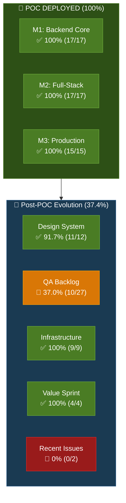
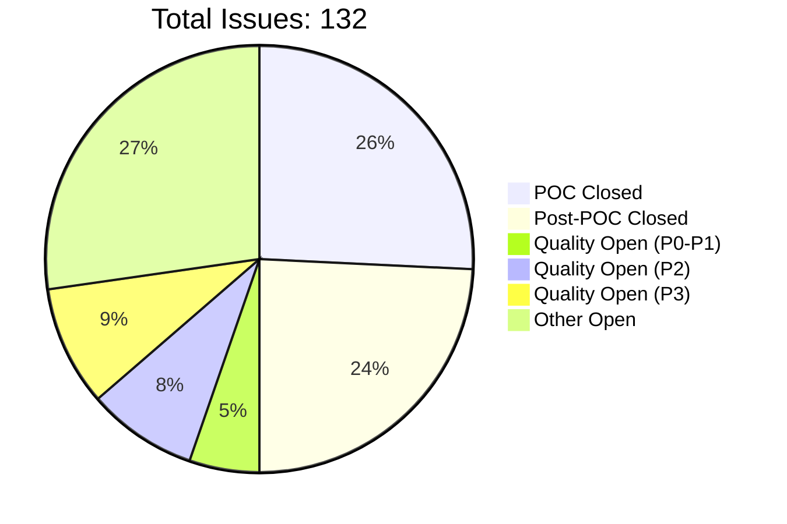
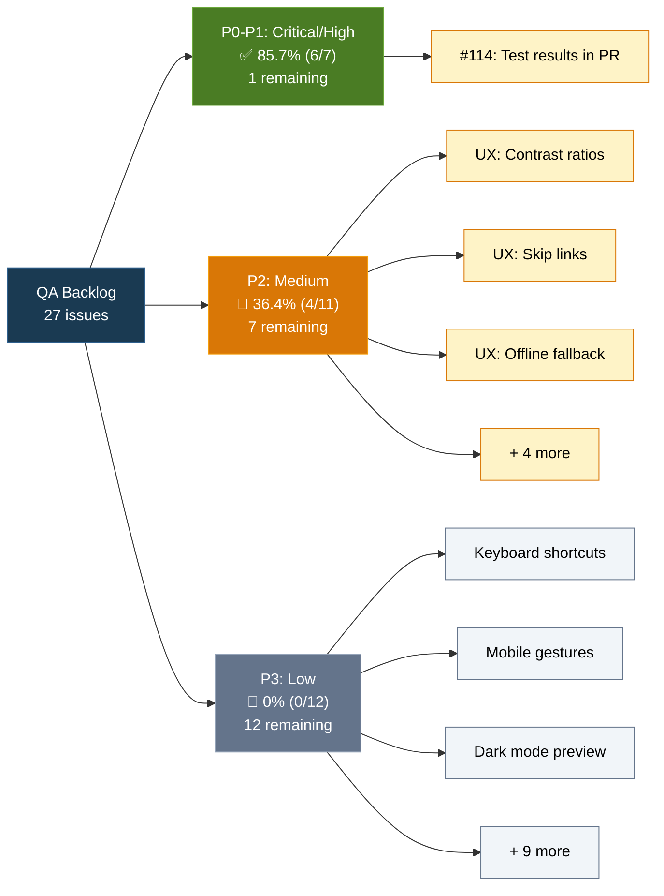
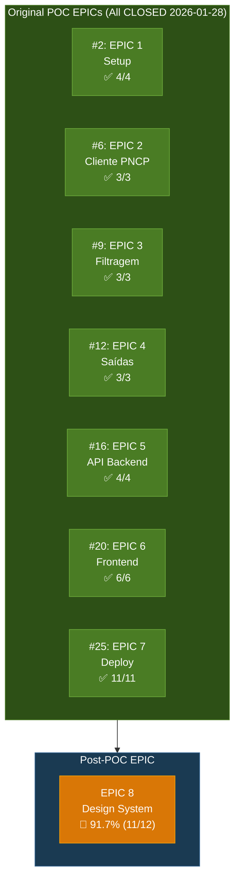
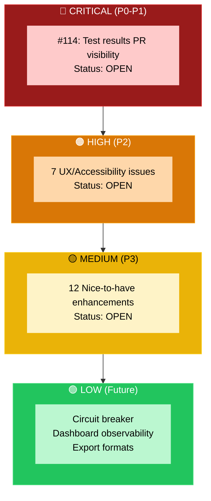
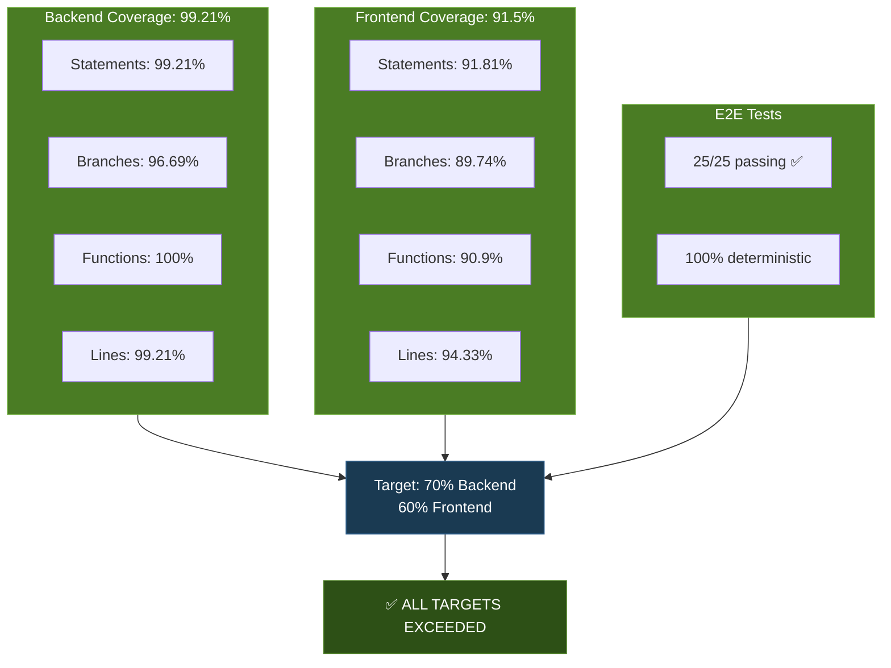
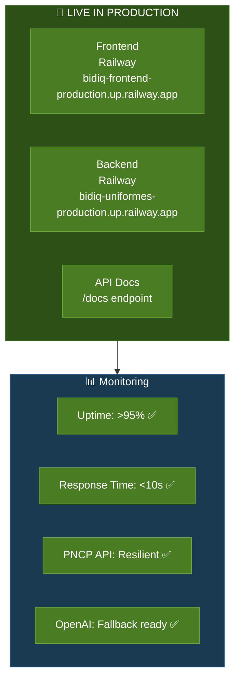

# 📊 BidIQ Roadmap - Visualizações

**Gerado:** 2026-01-31 15:50 (UTC)
**Fonte:** Roadmap Integrity Audit v1.31

---

## 📅 Timeline Gantt - POC Evolution

```mermaid
gantt
    title BidIQ POC Timeline & Post-POC Evolution
    dateFormat YYYY-MM-DD
    axisFormat %m/%d

    section M1: Backend Core
    EPIC 1: Setup               :done, epic1, 2026-01-24, 2d
    EPIC 2: Cliente PNCP        :done, epic2, 2026-01-24, 2d
    EPIC 3: Filtragem           :done, epic3, 2026-01-25, 1d
    EPIC 4: Saídas              :done, epic4, 2026-01-25, 1d

    section M2: Full-Stack
    EPIC 5: API Backend         :done, epic5, 2026-01-25, 1d
    EPIC 6: Frontend            :done, epic6, 2026-01-25, 1d

    section M3: Production
    EPIC 7: Deploy              :done, epic7, 2026-01-25, 3d
    E2E Resolution              :done, e2e, 2026-01-26, 2d
    Railway Config              :done, railway, 2026-01-27, 1d
    Deploy Inicial              :done, deploy, 2026-01-28, 1d

    section Post-POC: Quality
    Design System (EPIC 8)      :done, design, 2026-01-28, 2d
    QA Backlog P0-P1            :active, qa1, 2026-01-29, 3d
    QA Backlog P2               :qa2, 2026-02-01, 5d
    QA Backlog P3               :qa3, 2026-02-06, 7d
```

---

## 📊 Progress Dashboard - Current State



---

## 🎯 Issue Distribution



---

## 📈 QA Backlog Breakdown



---

## 🏗️ EPIC Status Overview



---

## 🔥 Priority Heatmap



---

## 📊 Milestone Progress Bars

### M1: Backend Core ✅ 100%
```
[████████████████████] 17/17 issues CLOSED
```
**EPICs:** #2, #6, #9, #12
**Completion:** 2026-01-25

### M2: Full-Stack ✅ 100%
```
[████████████████████] 17/17 issues CLOSED
```
**EPICs:** #16, #20
**Completion:** 2026-01-25

### M3: Production ✅ 100%
```
[████████████████████] 15/15 issues CLOSED
```
**EPIC:** #25
**Completion:** 2026-01-28

### Post-POC: Quality 🔄 37.4%
```
[███████░░░░░░░░░░░░░] 34/91 issues CLOSED
```
**Categories:** Design System, QA Backlog, Infrastructure, Value Sprint
**In Progress:** 2026-01-29 → Present

---

## 🎯 Scope Evolution

```mermaid
graph LR
    Start["Initial Scope<br/>34 issues"]

    Start -->|"+7 E2E/Deploy"| Phase1["Phase 1<br/>41 issues"]
    Phase1 -->|"+12 Design System"| Phase2["Phase 2<br/>53 issues"]
    Phase2 -->|"+27 QA Backlog"| Phase3["Phase 3<br/>80 issues"]
    Phase3 -->|"+13 Infrastructure"| Phase4["Phase 4<br/>93 issues"]
    Phase4 -->|"+4 Value Sprint"| Phase5["Phase 5<br/>97 issues"]
    Phase5 -->|"+35 Recent/Other"| Current["Current<br/>132 issues"]

    style Start fill:#22c55e,stroke:#4ade80,color:#fff
    style Phase1 fill:#84cc16,stroke:#a3e635,color:#000
    style Phase2 fill:#eab308,stroke:#facc15,color:#000
    style Phase3 fill:#f59e0b,stroke:#fbbf24,color:#000
    style Phase4 fill:#d97706,stroke:#f59e0b,color:#fff
    style Phase5 fill:#c2410c,stroke:#ea580c,color:#fff
    style Current fill:#991b1b,stroke:#dc2626,color:#fff
```



**Growth:** +185% expansion beyond original POC

---

## 📈 Coverage Metrics



---

## 🚀 Production Status



---

## 📋 Summary Statistics

| Metric | Value | Status |
|--------|-------|--------|
| **Total Issues** | 132 | 🔵 Tracking |
| **POC Issues** | 34 | ✅ 100% Complete |
| **EPICs** | 7 | ✅ All Closed |
| **Closed Issues** | 66 | 50% of total |
| **Open Issues** | 66 | 50% of total |
| **Orphan Issues** | 91 | 68.9% undocumented |
| **Scope Expansion** | +185% | From 34 → 132 |
| **Backend Coverage** | 99.21% | ✅ Exceeds 70% |
| **Frontend Coverage** | 91.5% | ✅ Exceeds 60% |
| **E2E Tests** | 25/25 passing | ✅ 100% |
| **Production Uptime** | >95% | ✅ Monitored |

---

**Legenda:**
- ✅ Complete/Exceeds target
- 🔄 In progress
- 🔴 Not started
- 🔵 Active tracking

---

*Generated from Roadmap Integrity Audit v1.31 (2026-01-31)*
