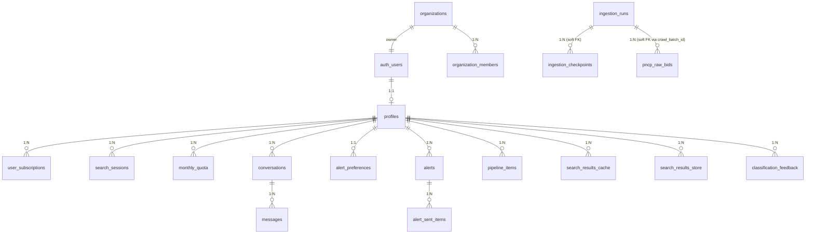

# SmartLic Database Schema

## Overview

- **Database**: Supabase PostgreSQL 17
- **Project ref**: `fqqyovlzdzimiwfofdjk`
- **Schema snapshot**: 2026-04-14
- **Reconstructed from**: `supabase/migrations/*.sql` (35+ files) + `backend/migrations/*.py` (7+ files)
- **Total tables**: 23
- **RPC functions**: 5+
- **Triggers**: 12+
- **Extensions**: `pg_cron`, `pg_trgm`, `uuid-ossp`, `pgcrypto`

---

## Table Inventory

### 1. `profiles`
- **Purpose**: User identity and plan assignment (extends `auth.users`)
- **Row estimate**: ~500-5K
- **Columns**:
  | Column | Type | Nullable | Default | Description |
  |--------|------|----------|---------|-------------|
  | id | uuid | NO | - | PK, FK → auth.users(id) ON DELETE CASCADE |
  | email | text | NO | - | NO UNIQUE constraint (⚠️ HIGH-002) |
  | full_name | text | YES | - | |
  | company | text | YES | - | |
  | plan_type | text | NO | 'free_trial' | CHECK (in enum list) |
  | avatar_url | text | YES | - | |
  | is_admin | boolean | NO | false | |
  | is_master | boolean | NO | false | |
  | created_at | timestamptz | NO | now() | |
  | updated_at | timestamptz | NO | now() | Maintained by trigger |
- **Indexes**: `idx_profiles_is_admin` (partial WHERE is_admin=true)
- **RLS**: SELECT/UPDATE own; service_role ALL
- **Triggers**: `profiles_updated_at` BEFORE UPDATE (uses `update_updated_at` → consolidated to `set_updated_at` em DEBT-001)

### 2. `plans`
- **Purpose**: Billing plan catalog (static reference)
- **Row estimate**: 15-20
- **Columns**: `id text PK, name, description, max_searches INT (null=unlimited), price_brl, duration_days, stripe_price_id, is_active, created_at`
- **RLS**: SELECT all (public catalog)
- **Notes**: Legacy plans marked inactive; current tiers: `free`, `free_trial`, `consultor_agil` (50/mo), `maquina` (300/mo), `sala_guerra` (1000/mo), `master`, `smartlic_pro`, `consultoria`.

### 3. `user_subscriptions`
- **Purpose**: Track active subscriptions and pack purchases
- **Columns**: `id uuid PK, user_id FK profiles, plan_id FK plans, credits_remaining INT (null=unlimited), starts_at, expires_at, stripe_subscription_id, stripe_customer_id, is_active, created_at, updated_at`
- **Indexes**: `idx_user_subscriptions_user`; partial `idx_user_subscriptions_active` (user_id, is_active) WHERE is_active
- **RLS**: SELECT own; (⚠️ NO INSERT policy — service_role only)

### 4. `search_sessions`
- **Purpose**: User search history and results metadata
- **Row estimate**: 10K-50K
- **Columns**: `id uuid PK, user_id FK profiles, search_id uuid, sectors text[], ufs text[], data_inicial date, data_final date, custom_keywords text[], total_raw int, total_filtered int, valor_total numeric, resumo_executivo text, destaques text[], excel_storage_path, params_hash text, created_at`
- **Indexes**: `idx_search_sessions_user`; `idx_search_sessions_created` (user_id, created_at DESC); `idx_search_sessions_user_id` (post-CRIT-002 fix)
- **RLS**: SELECT/INSERT own; service_role ALL (⚠️ policy adicionada post-launch em `006b_search_sessions_service_role_policy.sql`)

### 5. `monthly_quota`
- **Purpose**: Monthly search quota tracking
- **Columns**: `id uuid PK, user_id FK auth.users, month_year varchar(7) "YYYY-MM", searches_count int, created_at, updated_at`
- **Constraint**: UNIQUE (user_id, month_year)
- **Indexes**: `idx_monthly_quota_user_month`
- **RLS**: SELECT own; service_role ALL
- **Used by**: `increment_quota_atomic()` RPC

### 6. `stripe_webhook_events`
- **Purpose**: Idempotent webhook processing (90-day retention)
- **Columns**: `id varchar(255) PK (evt_* format), type varchar(100), processed_at timestamptz, payload jsonb`
- **Constraint**: CHECK (id ~ '^evt_')
- **Indexes**: `idx_webhook_events_type` (type, processed_at); `idx_webhook_events_recent` (processed_at DESC)
- **RLS**: INSERT service_role; SELECT master users only (⚠️ HIGH-001 — admins sem acesso)
- **Notes**: Imutável; 90-day retention manual.

### 7. `conversations`
- **Purpose**: Support ticket system
- **Columns**: `id uuid PK, user_id FK profiles, subject text (max 200), category text (suporte/sugestao/funcionalidade/bug/outro), status (aberto/respondido/resolvido), last_message_at, created_at, updated_at`
- **Indexes**: `idx_conversations_user_id`; `idx_conversations_status`; `idx_conversations_last_message` (DESC)
- **RLS**: own/admin SELECT; own INSERT; admin UPDATE/DELETE
- **Triggers**: `trg_update_conversation_last_message` (AFTER INSERT messages)

### 8. `messages`
- **Purpose**: Support messages within conversations
- **Columns**: `id uuid PK, conversation_id FK, sender_id FK profiles, body text (1-5000), is_admin_reply bool, read_by_user, read_by_admin, created_at`
- **Indexes**: `idx_messages_conversation` (conversation_id, created_at); partial `idx_messages_unread_by_user`/`admin`
- **RLS**: via conversation ownership (⚠️ HIGH-003 — triple nested EXISTS policy)

### 9. `alert_preferences`
- **Purpose**: Per-user email digest config
- **Columns**: `id uuid PK, user_id FK profiles UNIQUE, frequency (daily/twice_weekly/weekly/off), enabled bool, last_digest_sent_at, created_at, updated_at`
- **Indexes**: `idx_alert_preferences_user_id`; partial `idx_alert_preferences_digest_due` (enabled, frequency, last_digest_sent_at) WHERE enabled AND frequency!='off'
- **RLS**: own CRUD; service_role ALL
- **Triggers**: Auto-created on profile creation

### 10. `alerts`
- **Purpose**: User-defined email alerts
- **Columns**: `id uuid PK, user_id FK profiles, name text, filters jsonb ({setor, ufs[], valor_min/max, keywords[]}), active bool, created_at, updated_at`
- **Indexes**: `idx_alerts_user_id`; partial `idx_alerts_active` (user_id, active) WHERE active
- **RLS**: own CRUD; service_role ALL

### 11. `alert_sent_items`
- **Purpose**: Dedup tracking (prevent duplicate email sends)
- **Columns**: `id uuid PK, alert_id FK alerts, item_id text (PNCP bid ID), sent_at`
- **Indexes**: UNIQUE (alert_id, item_id); (alert_id); (sent_at)
- **RLS**: service_role ALL; own via alert ownership

### 12. `health_checks`
- **Purpose**: Uptime monitoring snapshots (30-day retention)
- **Columns**: `id uuid PK, checked_at, overall_status (healthy/degraded/unhealthy), sources_json jsonb, components_json jsonb, latency_ms int`
- **Indexes**: `idx_health_checks_checked_at` DESC
- **RLS**: None (public status page)

### 13. `incidents`
- **Purpose**: Status page incidents
- **Columns**: `id uuid PK, started_at, resolved_at, status (ongoing/resolved), affected_sources text[], description text`
- **Indexes**: partial `idx_incidents_status` WHERE status='ongoing'; `idx_incidents_started_at` DESC
- **RLS**: None (public)

### 14. `organizations`
- **Purpose**: Multi-tenant org support (consultoria/agency)
- **Columns**: `id uuid PK, name, logo_url, owner_id FK auth.users ON DELETE RESTRICT, max_members int default 5, plan_type, stripe_customer_id, created_at, updated_at`
- **Indexes**: `idx_organizations_owner`
- **RLS**: owner/admin SELECT; owner INSERT/UPDATE; service_role ALL
- **Notes**: ON DELETE RESTRICT prevents owner deletion while org exists.

### 15. `organization_members`
- **Purpose**: Org membership + roles
- **Columns**: `id uuid PK, org_id FK, user_id FK auth.users, role (owner/admin/member), invited_at, accepted_at (null=pending)`
- **Indexes**: `idx_org_members_org`; `idx_org_members_user`
- **Constraint**: UNIQUE (org_id, user_id)
- **RLS**: own membership SELECT; owner/admin CRUD; users leave

### 16. `pipeline_items`
- **Purpose**: Procurement opportunity kanban
- **Row estimate**: 5K-50K
- **Columns**: `id uuid PK, user_id FK auth.users, pncp_id text, objeto text, orgao, uf, valor_estimado numeric, data_encerramento, link_pncp, stage (descoberta/analise/preparando/enviada/resultado), notes, created_at, updated_at`
- **Indexes**: `idx_pipeline_user_stage`; partial `idx_pipeline_encerramento` WHERE stage NOT IN ('enviada','resultado'); `idx_pipeline_user_created` (DESC); `idx_pipeline_items_user_id` (post-CRIT-002)
- **Constraint**: UNIQUE (user_id, pncp_id)
- **RLS**: own CRUD; service_role ALL
- **Notes**: Snapshots denormalized (no FK to pncp_raw_bids) for audit preservation.

### 17. `search_results_cache`
- **Purpose**: L3 persistent SWR cache (last 5 per user, 24h TTL)
- **Columns**: `id uuid PK, user_id FK auth.users, params_hash text, search_params jsonb, results jsonb, sources_json jsonb default '["pncp"]', total_results int, fetched_at, created_at`
- **Indexes**: `idx_search_cache_user` (user_id, created_at DESC); `idx_search_cache_params_hash`; `idx_search_cache_fetched_at`
- **Constraint**: UNIQUE (user_id, params_hash)
- **RLS**: service_role ALL; own SELECT
- **Triggers**: `trg_cleanup_search_cache` AFTER INSERT (mantém max 5/user)
- **Notes**: 24h TTL enforced at app layer (não DB). ⚠️ TD-SYS-016: sem pg_cron cleanup global.

### 18. `search_results_store`
- **Purpose**: Long-term persistent storage (fallback para expired cache)
- **Columns**: `search_id uuid PK, user_id FK auth.users, results jsonb, sector text, ufs text[], total_filtered int, created_at, expires_at (default now()+24h)`
- **Indexes**: `idx_search_results_user`; `idx_search_results_expires`; `idx_search_results_store_user_id` (post-CRIT-002)
- **RLS**: own SELECT; service_role ALL
- **Notes**: Imutável (sem UPDATE); 24h soft TTL; ⚠️ sem cron cleanup.

### 19. `pncp_raw_bids` (Data Lake Layer 1)
- **Purpose**: Raw PNCP bid ingestion
- **Row estimate**: 40K-100K (12-day retention)
- **Columns**:
  | Column | Type | Nullable | Notes |
  |--------|------|----------|-------|
  | pncp_id | text | NO | PK (natural key) |
  | objeto_compra | text | NO | |
  | valor_total_estimado | numeric(18,2) | YES | |
  | modalidade_id | int | YES | |
  | modalidade_nome | text | YES | |
  | situacao_compra | text | YES | |
  | esfera_id | text | YES | federal/estadual/municipal |
  | uf | text | NO | |
  | municipio | text | YES | |
  | codigo_municipio_ibge | text | YES | |
  | orgao_razao_social | text | YES | |
  | orgao_cnpj | text | YES | |
  | unidade_nome | text | YES | |
  | data_publicacao | date | YES | |
  | data_abertura | date | YES | |
  | data_encerramento | date | YES | |
  | link_sistema_origem | text | YES | |
  | link_pncp | text | YES | |
  | content_hash | text | NO | MD5 for change detection |
  | tsv | tsvector | NO | Pre-computed Portuguese FTS (DEBT-210) |
  | ingested_at | timestamptz | NO | |
  | updated_at | timestamptz | NO | |
  | source | text | NO | default 'pncp' |
  | crawl_batch_id | text | YES | soft-FK to ingestion_runs |
  | is_active | boolean | NO | Soft-delete flag |
- **Indexes** (8):
  - `idx_pncp_raw_bids_fts` GIN(tsv)
  - `idx_pncp_raw_bids_uf_date` (uf, data_publicacao DESC) WHERE is_active
  - `idx_pncp_raw_bids_modalidade` (modalidade_id) WHERE is_active
  - `idx_pncp_raw_bids_valor` (valor_total_estimado) WHERE is_active AND valor_total_estimado IS NOT NULL
  - `idx_pncp_raw_bids_esfera` (esfera_id) WHERE is_active
  - `idx_pncp_raw_bids_encerramento` (data_encerramento) WHERE is_active
  - `idx_pncp_raw_bids_content_hash` (content_hash)
  - `idx_pncp_raw_bids_ingested_at` (ingested_at DESC)
- **RLS**: SELECT authenticated (Lei 14.133 public data); INSERT/UPDATE/DELETE service_role
- **Triggers**: `trg_pncp_raw_bids_updated_at`; `trg_pncp_raw_bids_tsv` (maintains tsv)
- **Notes**: Soft-delete via `is_active=false`; 12-day retention via `purge_old_bids()` (⚠️ cron não confirmado — MED-001).

### 20. `ingestion_checkpoints`
- **Purpose**: Resumable crawl checkpoints
- **Columns**: `id bigint GENERATED AS IDENTITY PK, source ('pncp'), uf, modalidade_id int, last_date date, last_page int, records_fetched int, status (pending/running/completed/failed), error_message, started_at, completed_at, crawl_batch_id text`
- **Constraint**: UNIQUE (source, uf, modalidade_id, crawl_batch_id)
- **Indexes**: `idx_ingestion_checkpoints_batch`; `idx_ingestion_checkpoints_uf_mod`
- **RLS**: SELECT authenticated; ALL service_role

### 21. `ingestion_runs`
- **Purpose**: Audit trail of ingestion runs
- **Columns**: `id bigint GENERATED AS IDENTITY PK, crawl_batch_id text UNIQUE, run_type (full/incremental), status (running/completed/failed/partial), started_at, completed_at, total_fetched, inserted, updated, unchanged, errors, ufs_completed text[], ufs_failed text[], duration_s numeric, metadata jsonb`
- **Indexes**: `idx_ingestion_runs_started` DESC; partial `idx_ingestion_runs_status` WHERE status IN ('running','failed')
- **RLS**: SELECT authenticated; ALL service_role

### 22. `audit_events`
- **Purpose**: Audit log (12-month retention via pg_cron)
- **Columns**: `id uuid PK, timestamp timestamptz, event_type text, actor_id_hash text (SHA-256 16-char), target_id_hash text, ip_hash text, metadata jsonb, severity (info/warn/error/crit)`
- **RLS**: admin SELECT; service INSERT
- **Retention**: pg_cron schedule `'cleanup-audit-events', '0 4 1 * *'`
- **Notes**: LGPD/GDPR compliant via hashing.

### 23. `partner_referrals`
- **Purpose**: Partner/affiliate tracking (⚠️ feature status WIP)
- **Columns**: `id uuid PK, referrer_partner_id, referred_user_id FK profiles ON DELETE SET NULL (DEBT-001 fix), code text, credited_at, reward_type text, metadata jsonb, created_at`
- **Notes**: Referenced but rarely used in code — pendente de confirmação pelo @architect.

### 24. `classification_feedback`
- **Purpose**: User feedback on LLM classification accuracy (bi-gram analysis source)
- **Columns**: `id uuid PK, user_id FK auth.users, pncp_id text, feedback_type (accepted/rejected/pending), sector text, classification_source text, metadata jsonb, created_at`
- **Indexes**: `idx_classification_feedback_user_id` (post-CRIT-002)
- **RLS**: own CRUD; admin SELECT
- **Notes**: Migration existência condicional — confirmar com @architect.

---

## RPC Functions

### 1. `increment_quota_atomic(p_user_id UUID, p_month_year VARCHAR(7), p_max_quota INT)`
- Atomic SELECT FOR UPDATE + INSERT ON CONFLICT
- Returns: `TABLE(new_count INT, was_at_limit BOOLEAN, previous_count INT)`
- SECURITY DEFINER; granted to `service_role`

### 2. `check_and_increment_quota(p_user_id UUID, p_month_year VARCHAR(7), p_max_quota INT)`
- Combined check+increment atomic
- Returns: `TABLE(allowed BOOLEAN, new_count INT, previous_count INT, quota_remaining INT)`
- SECURITY DEFINER; granted to `service_role`

### 3. `search_datalake(p_ufs TEXT[], p_date_start DATE, p_date_end DATE, p_tsquery TEXT, p_modalidades INT[], p_valor_min NUMERIC, p_valor_max NUMERIC, p_esferas TEXT[], p_modo TEXT DEFAULT 'publicacao', p_limit INT DEFAULT 2000)`
- Full-text + multi-filter search on pncp_raw_bids
- `p_modo`: 'publicacao' (by publication date) ou 'abertas' (future deadlines only)
- `p_tsquery`: Portuguese; falls back para `plainto_tsquery` on error
- `p_limit`: capped at 5000
- Uses pre-computed `tsv` column (DEBT-210)
- Returns: `TABLE(pncp_id, objeto_compra, valor_total_estimado, modalidade_id, modalidade_nome, situacao_compra, esfera_id, uf, municipio, orgao_razao_social, orgao_cnpj, data_publicacao, data_abertura, data_encerramento, link_pncp, ts_rank REAL)`
- SECURITY DEFINER; granted to `authenticated`, `service_role`

### 4. `upsert_pncp_raw_bids(p_records JSONB)`
- Bulk insert/update with content-hash dedup
- DISTINCT ON (pncp_id) deduplica intra-batch
- INSERT ON CONFLICT (pncp_id) DO UPDATE WHERE content_hash != excluded.content_hash
- `xmax = 0` trick diferencia inserts de updates
- Single-statement replaces row-by-row FOR loop (DEBT-210 optimization)
- Returns: `TABLE(inserted INT, updated INT, unchanged INT)`
- SECURITY DEFINER; granted to `service_role`

### 5. `purge_old_bids(p_retention_days INTEGER DEFAULT 12)`
- Hard delete (not soft) bids older than retention window
- Default: 12 days
- Returns: INTEGER (count of deleted rows)
- SECURITY DEFINER; granted to `service_role`
- ⚠️ **MED-001**: Cron job NOT confirmed scheduled em produção.

---

## Extensions

```sql
CREATE EXTENSION IF NOT EXISTS pg_cron;     -- Scheduled jobs (audit cleanup, purge)
CREATE EXTENSION IF NOT EXISTS pg_trgm;     -- Trigram similarity (fuzzy match)
CREATE EXTENSION IF NOT EXISTS "uuid-ossp"; -- UUID generation
CREATE EXTENSION IF NOT EXISTS pgcrypto;    -- Hashing (SHA-256 for audit PII)
```

---

## Schema Relationships (Mermaid)



---

## Migration History Summary (chronological)

| Timestamp            | Filename                                               | Purpose                                                 |
|----------------------|--------------------------------------------------------|---------------------------------------------------------|
| 2026-02-01           | `001_profiles_and_sessions.sql`                        | Initial profiles + search_sessions + plans              |
| 2026-02-05           | `002_user_subscriptions.sql`                           | Subscriptions table                                     |
| 2026-02-07           | `003_search_cache.sql`                                 | search_results_cache + cleanup trigger                  |
| 2026-02-10           | `006b_search_sessions_service_role_policy.sql`         | HOTFIX: add service_role policy (CRIT-001)              |
| 2026-02-15           | `010_monthly_quota.sql`                                | Quota tracking + increment_quota_atomic RPC             |
| 2026-02-20           | `012_create_messages.sql`                              | Conversations + messages                                |
| 2026-02-23           | `015_pipeline_items.sql`                               | Kanban pipeline table                                   |
| 2026-03-01           | `020260301100000_organizations.sql`                    | Multi-tenant orgs                                       |
| 2026-03-01           | `020260301200000_partner_referrals.sql`                | Referrals table (feature WIP)                           |
| 2026-03-07           | `020260307100000_add_user_id_indexes.sql`              | ⚠️ BUG: wrong table names (searches, pipeline, feedback)|
| 2026-03-08           | `020260308100000_debt001_database_integrity_fixes.sql` | MAJOR: CRIT-002 indexes fix, CRIT-003 NOT NULL, CRIT-004 functions consolidation |
| 2026-03-20           | `023_audit_events.sql`                                 | audit_events + pg_cron schedule                         |
| 2026-03-25           | `025_ingestion_tables.sql`                             | ingestion_checkpoints + ingestion_runs                  |
| 2026-03-26           | `020260326000000_pncp_raw_bids.sql`                    | Data lake table + purge_old_bids RPC                    |
| 2026-03-28           | `026_search_results_cache_cleanup.sql`                 | Cleanup trigger max 5/user                              |
| 2026-03-31           | `020260331400000_pncp_raw_bids_tsv.sql`                | DEBT-210: pre-computed tsv + batch upsert_pncp_raw_bids |
| 2026-04-10           | `20260410150000_fix_is_master_trigger_story415.sql`    | is_master flag trigger fix                              |

**Note**: Nomes de arquivos são aproximados — verificar com `ls supabase/migrations/` para lista definitiva.

---

## Key Observations

- **Layer 1 (Raw)**: `pncp_raw_bids` + `ingestion_checkpoints` + `ingestion_runs` (Data Lake)
- **Layer 2 (Computed)**: `search_datalake` RPC (full-text + filters, bypasses RLS)
- **Layer 3 (Cache)**: `search_results_cache` (SWR L2) + `search_results_store` (L3 fallback)
- **User Dimension**: `profiles`, `user_subscriptions`, `search_sessions`, `alerts`, `pipeline_items`, `monthly_quota`
- **Observability**: `audit_events` (12-month retention), `health_checks`, `incidents`
- **Messaging**: `conversations` + `messages`
- **Multi-Tenant**: `organizations` + `organization_members`
- **Timestamp Discipline**: Todas tabelas têm `created_at`; a maioria tem `updated_at` (maintained by triggers `set_updated_at`).
- **RLS Ubiquity**: Service_role bypass em todas user-data tables (necessário pelo backend).
- **Soft Deletes**: `user_subscriptions` (is_active), `pncp_raw_bids` (is_active).
- **Debt Density**: ~60% das 35+ migrations focam em fixes/debt paydown — sinal de iteração agressiva pós-launch.

---

**Document Status**: 2.0 (2026-04-14) — Phase 2 of brownfield-discovery complete.
