# SmartLic Database Schema

**Generated:** 2026-03-23 | **Auditor:** @data-engineer (Dara) — Brownfield Discovery Phase 2
**Source:** 80+ migration files in `supabase/migrations/`
**Database:** PostgreSQL 17 (Supabase Cloud) | **Extensions:** pg_trgm, pg_cron

---

## Tables Overview (32 tables)

| # | Table | Purpose | Origin Migration |
|---|-------|---------|-----------------|
| 1 | profiles | User profiles (extends auth.users) | 001 |
| 2 | plans | Plan catalog (pricing tiers) | 001 |
| 3 | user_subscriptions | Active subscriptions per user | 001 |
| 4 | search_sessions | Search history per user | 001 |
| 5 | monthly_quota | Monthly search quota tracking | 002 |
| 6 | plan_features | Billing-period-specific feature flags | 009 |
| 7 | stripe_webhook_events | Stripe webhook idempotency | 010 |
| 8 | conversations | InMail support conversations | 012 |
| 9 | messages | Messages within conversations | 012 |
| 10 | user_oauth_tokens | Encrypted OAuth 2.0 tokens | 013 |
| 11 | google_sheets_exports | Google Sheets export history | 014 |
| 12 | audit_events | Privacy-compliant audit log | 023 |
| 13 | pipeline_items | Opportunity pipeline (kanban) | 025 |
| 14 | search_results_cache | L2 persistent search cache (SWR) | 026 |
| 15 | plan_billing_periods | Multi-period pricing | 029 |
| 16 | trial_email_log | Trial email dedup tracking | 20260224 |
| 17 | alert_preferences | Email digest scheduling per user | 20260226 |
| 18 | alerts | User-defined email alerts | 20260227 |
| 19 | alert_sent_items | Alert dedup tracking | 20260227 |
| 20 | alert_runs | Alert execution history | 20260228 |
| 21 | reconciliation_log | Stripe-DB sync audit trail | 20260228 |
| 22 | health_checks | Periodic health check results | 20260228 |
| 23 | incidents | System incidents for status page | 20260228 |
| 24 | mfa_recovery_codes | TOTP MFA backup codes | 20260228 |
| 25 | mfa_recovery_attempts | Brute force tracking for MFA | 20260228 |
| 26 | organizations | Multi-user org accounts | 20260301 |
| 27 | organization_members | Org membership + roles | 20260301 |
| 28 | partners | Revenue share partners | 20260301 |
| 29 | partner_referrals | Partner referral tracking | 20260301 |
| 30 | search_results_store | L3 persistent search results | 20260303 |
| 31 | search_state_transitions | Search state machine audit trail | 20260221 |
| 32 | classification_feedback | User feedback on LLM classification | debt002 |

---

## Detailed Table Definitions

### 1. profiles

Extends `auth.users`. Auto-created via `handle_new_user()` trigger on signup.

| Column | Type | Nullable | Default | Notes |
|--------|------|----------|---------|-------|
| id | uuid | NO | - | PK, FK -> auth.users(id) ON DELETE CASCADE |
| email | text | NO | - | Unique partial index |
| full_name | text | YES | - | |
| company | text | YES | - | |
| plan_type | text | NO | 'free_trial' | CHECK: free_trial, consultor_agil, maquina, sala_guerra, master, smartlic_pro |
| avatar_url | text | YES | - | |
| is_admin | boolean | NO | false | Partial index WHERE true |
| sector | text | YES | - | |
| phone_whatsapp | text | YES | - | CHECK: 10-11 digits regex. Partial unique index |
| whatsapp_consent | boolean | YES | false | |
| whatsapp_consent_at | timestamptz | YES | - | LGPD audit trail |
| context_data | jsonb | YES | '{}'::jsonb | CHECK: < 512KB |
| subscription_status | text | YES | 'trial' | CHECK: trial, active, canceling, past_due, expired |
| trial_expires_at | timestamptz | YES | - | |
| subscription_end_date | timestamptz | YES | - | |
| email_unsubscribed | boolean | YES | false | |
| email_unsubscribed_at | timestamptz | YES | - | |
| marketing_emails_enabled | boolean | NO | true | |
| referred_by_partner_id | uuid | YES | - | FK -> partners(id) |
| created_at | timestamptz | NO | now() | |
| updated_at | timestamptz | NO | now() | Auto-updated via trigger |

**Indexes:** idx_profiles_is_admin (partial), idx_profiles_whatsapp_consent (partial), idx_profiles_email_trgm (GIN trigram), idx_profiles_phone_whatsapp_unique (partial unique), idx_profiles_email_unique (partial unique), idx_profiles_context_porte (btree on JSONB expression), idx_profiles_subscription_status (partial), idx_profiles_referred_by_partner (partial)

**RLS Policies:** profiles_select_own (user reads own), profiles_update_own (user updates own), profiles_insert_own (authenticated), profiles_insert_service (service_role), profiles_service_all (service_role full access)

---

### 2. plans

Plan catalog with pricing tiers.

| Column | Type | Nullable | Default | Notes |
|--------|------|----------|---------|-------|
| id | text | NO | - | PK (e.g. 'smartlic_pro') |
| name | text | NO | - | |
| description | text | YES | - | |
| max_searches | int | YES | - | NULL = unlimited |
| price_brl | numeric(10,2) | NO | 0 | |
| duration_days | int | YES | - | NULL = perpetual |
| stripe_price_id | text | YES | - | DEPRECATED |
| stripe_price_id_monthly | text | YES | - | |
| stripe_price_id_semiannual | text | YES | - | |
| stripe_price_id_annual | text | YES | - | |
| is_active | boolean | NO | true | |
| created_at | timestamptz | NO | now() | |
| updated_at | timestamptz | NO | now() | |

**RLS:** plans_select_all (public read)

---

### 3. user_subscriptions

| Column | Type | Nullable | Default | Notes |
|--------|------|----------|---------|-------|
| id | uuid | NO | gen_random_uuid() | PK |
| user_id | uuid | NO | - | FK -> profiles(id) CASCADE |
| plan_id | text | NO | - | FK -> plans(id) RESTRICT |
| credits_remaining | int | YES | - | NULL = unlimited |
| starts_at | timestamptz | NO | now() | |
| expires_at | timestamptz | YES | - | |
| stripe_subscription_id | text | YES | - | Unique partial index |
| stripe_customer_id | text | YES | - | Partial index |
| is_active | boolean | NO | true | |
| billing_period | varchar(10) | NO | 'monthly' | CHECK: monthly, semiannual, annual |
| annual_benefits | jsonb | NO | '{}'::jsonb | CHECK: < 512KB |
| subscription_status | text | YES | 'active' | CHECK: active, trialing, past_due, canceled, expired |
| first_failed_at | timestamptz | YES | - | Dunning tracking |
| version | integer | NO | 1 | Optimistic locking |
| created_at | timestamptz | NO | now() | |
| updated_at | timestamptz | NO | now() | |

**Triggers:** trg_sync_subscription_status -> sync_subscription_status_to_profile()

---

### 4. search_sessions

| Column | Type | Nullable | Default | Notes |
|--------|------|----------|---------|-------|
| id | uuid | NO | gen_random_uuid() | PK |
| user_id | uuid | NO | - | FK -> profiles(id) CASCADE |
| sectors | text[] | NO | - | |
| ufs | text[] | NO | - | |
| data_inicial | date | NO | - | |
| data_final | date | NO | - | |
| custom_keywords | text[] | YES | - | |
| total_raw | int | NO | 0 | |
| total_filtered | int | NO | 0 | |
| valor_total | numeric(14,2) | YES | 0 | |
| resumo_executivo | text | YES | - | |
| destaques | text[] | YES | - | |
| excel_storage_path | text | YES | - | |
| search_id | uuid | YES | - | Links to SSE tracker |
| status | text | NO | 'created' | CHECK: created, processing, completed, failed, timed_out, cancelled |
| error_message | text | YES | - | |
| error_code | text | YES | - | CHECK: 13 valid SearchErrorCode values |
| started_at | timestamptz | NO | now() | |
| completed_at | timestamptz | YES | - | |
| duration_ms | integer | YES | - | |
| pipeline_stage | text | YES | - | |
| raw_count | integer | YES | 0 | |
| response_state | text | YES | - | |
| failed_ufs | text[] | YES | - | |
| created_at | timestamptz | NO | now() | |

**Indexes:** idx_search_sessions_created, idx_search_sessions_search_id (partial), idx_search_sessions_status (partial), idx_search_sessions_inflight (partial), idx_search_sessions_user_status_created (composite), idx_search_sessions_user_created

**Retention:** pg_cron purges > 12 months

---

### 5. monthly_quota

| Column | Type | Nullable | Default | Notes |
|--------|------|----------|---------|-------|
| id | uuid | NO | gen_random_uuid() | PK |
| user_id | uuid | NO | - | FK -> profiles(id) CASCADE |
| month_year | varchar(7) | NO | - | "YYYY-MM" |
| searches_count | int | NO | 0 | |
| created_at | timestamptz | NO | now() | |
| updated_at | timestamptz | NO | now() | |

**Constraints:** UNIQUE(user_id, month_year)

**Retention:** pg_cron purges > 24 months

---

### 6. plan_features

| Column | Type | Nullable | Default | Notes |
|--------|------|----------|---------|-------|
| id | serial | NO | auto | PK |
| plan_id | text | NO | - | FK -> plans(id) CASCADE |
| billing_period | varchar(10) | NO | - | CHECK: monthly, semiannual, annual |
| feature_key | varchar(100) | NO | - | |
| enabled | boolean | NO | true | |
| metadata | jsonb | YES | '{}'::jsonb | CHECK: < 512KB |
| created_at | timestamptz | NO | now() | |
| updated_at | timestamptz | NO | now() | |

**Constraints:** UNIQUE(plan_id, billing_period, feature_key)

---

### 7. stripe_webhook_events

| Column | Type | Nullable | Default | Notes |
|--------|------|----------|---------|-------|
| id | varchar(255) | NO | - | PK. CHECK: starts with 'evt_' |
| type | varchar(100) | NO | - | |
| processed_at | timestamptz | NO | now() | |
| payload | jsonb | YES | - | CHECK: < 512KB |
| status | varchar(20) | NO | 'completed' | |
| received_at | timestamptz | YES | now() | |

**Retention:** pg_cron purges > 90 days

---

### 8. conversations / 9. messages

**conversations:** id (uuid PK), user_id (FK profiles), subject (CHECK <= 200), category (CHECK enum), status (CHECK enum), last_message_at, created_at, updated_at.

**messages:** id (uuid PK), conversation_id (FK conversations CASCADE), sender_id (FK profiles CASCADE), body (CHECK 1-5000), is_admin_reply, read_by_user, read_by_admin, created_at.

**Trigger:** New message auto-updates conversation.last_message_at.

---

### 10. user_oauth_tokens

id (uuid PK), user_id (FK profiles CASCADE), provider (CHECK: google/microsoft/dropbox), access_token (AES-256 encrypted), refresh_token (nullable), expires_at, scope, created_at, updated_at. UNIQUE(user_id, provider).

---

### 11. google_sheets_exports

id (uuid PK), user_id (FK profiles CASCADE), spreadsheet_id, spreadsheet_url, search_params (JSONB, GIN index, CHECK < 512KB), total_rows (CHECK >= 0), created_at, updated_at (renamed from last_updated_at).

---

### 12. audit_events

id (uuid PK), timestamp, event_type, actor_id_hash (SHA-256 truncated 16 hex), target_id_hash, details (JSONB, CHECK < 512KB), ip_hash. All PII hashed for LGPD/GDPR. Retention: 12 months.

---

### 13. pipeline_items

id (uuid PK), user_id (FK profiles CASCADE), pncp_id, objeto, orgao, uf, valor_estimado, data_encerramento, link_pncp, stage (CHECK: 5 values), notes, search_id (TEXT, not UUID FK -- intentional), version (optimistic locking), created_at, updated_at. UNIQUE(user_id, pncp_id).

---

### 14. search_results_cache

L2 SWR cache with hot/warm/cold priority, health metadata, and JSONB size governance.

id (uuid PK), user_id (FK profiles CASCADE), params_hash, params_hash_global, search_params (JSONB, CHECK < 512KB), results (JSONB, CHECK <= 2MB), total_results, sources_json (JSONB, CHECK < 512KB), fetched_at, priority (CHECK: hot/warm/cold), access_count, last_accessed_at, last_success_at, last_attempt_at, fail_streak, degraded_until, coverage (JSONB, CHECK < 512KB), fetch_duration_ms, created_at. UNIQUE(user_id, params_hash).

**Trigger:** Priority-aware eviction on INSERT (max 5/user with short-circuit).

---

### 15. plan_billing_periods

id (uuid PK), plan_id (FK plans CASCADE), billing_period (CHECK: monthly/semiannual/annual), price_cents, discount_percent, stripe_price_id, created_at, updated_at. UNIQUE(plan_id, billing_period).

---

### 16-20. Alert System

- **alert_preferences:** user_id (UNIQUE), frequency (alert_frequency ENUM), enabled, last_digest_sent_at, timestamps. Auto-created via trigger on profile INSERT.
- **alerts:** user_id, name, filters (JSONB, CHECK < 512KB), active, timestamps. Per-user CRUD.
- **alert_sent_items:** alert_id (FK CASCADE), item_id. UNIQUE(alert_id, item_id). 180-day retention.
- **alert_runs:** alert_id (FK CASCADE), run_at, items_found, items_sent, status (CHECK: 9 values). 90-day retention.

---

### 21-25. System/Monitoring

- **reconciliation_log:** id, run_at, total_checked, divergences_found, auto_fixed, manual_review, duration_ms, details (JSONB, CHECK < 512KB). 90-day retention.
- **health_checks:** id, checked_at, overall_status (CHECK: healthy/degraded/unhealthy), sources_json, components_json (CHECK < 512KB each), latency_ms. 30-day retention.
- **incidents:** id, started_at, resolved_at, status (CHECK: ongoing/resolved), affected_sources, description. 90-day retention.
- **mfa_recovery_codes:** id, user_id (FK auth.users CASCADE), code_hash, used_at, created_at.
- **mfa_recovery_attempts:** id, user_id (FK auth.users CASCADE), attempted_at, success. 30-day retention.

---

### 26-27. Organizations

- **organizations:** id, name, logo_url, owner_id (FK auth.users RESTRICT), max_members, plan_type (CHECK: 7 valid values), stripe_customer_id, timestamps. Complex role-based RLS.
- **organization_members:** id, org_id (FK organizations CASCADE), user_id (FK auth.users CASCADE), role (CHECK: owner/admin/member), invited_at, accepted_at. UNIQUE(org_id, user_id).

---

### 28-29. Partners

- **partners:** id, name, slug (UNIQUE), contact_email, contact_name, stripe_coupon_id, revenue_share_pct, status (CHECK), created_at, updated_at.
- **partner_referrals:** id, partner_id (FK partners CASCADE), referred_user_id (nullable, FK profiles SET NULL), signup_at, converted_at, churned_at, monthly_revenue, revenue_share_amount. UNIQUE(partner_id, referred_user_id).

---

### 30. search_results_store

L3 persistent storage (24h TTL). search_id (uuid PK), user_id (FK auth.users), results (JSONB), sector, ufs, total_filtered, created_at, expires_at. pg_cron purges expired daily.

---

### 31. search_state_transitions

id (uuid PK), search_id (uuid, NO FK -- intentional), from_state, to_state, stage, details (JSONB, CHECK < 512KB), duration_since_previous_ms, user_id (FK profiles CASCADE, added for RLS optimization), created_at. 30-day retention.

---

### 32. classification_feedback

id (uuid PK), user_id (FK profiles CASCADE), search_id, bid_id, setor_id, user_verdict (CHECK: 3 values), reason, category (CHECK: 6 values), bid_objeto, bid_valor, bid_uf, confidence_score, relevance_source, created_at. UNIQUE(user_id, search_id, bid_id). 24-month retention.

---

## Custom Types

| Type | Kind | Values | Used By |
|------|------|--------|---------|
| alert_frequency | ENUM | daily, twice_weekly, weekly, off | alert_preferences.frequency |

---

## Functions (16)

| Function | Returns | Purpose |
|----------|---------|---------|
| handle_new_user() | trigger | Auto-creates profile on signup. Phone normalization + TOCTOU handling |
| set_updated_at() | trigger | Canonical updated_at setter (consolidated) |
| increment_quota_atomic() | TABLE(new_count, was_at_limit, previous_count) | Atomic quota increment with limit check |
| check_and_increment_quota() | TABLE(allowed, new_count, previous_count, quota_remaining) | Primary quota path |
| increment_quota_fallback_atomic() | TABLE(new_count) | Fallback RPC for quota |
| get_user_billing_period() | varchar(10) | Current billing period |
| user_has_feature() | boolean | Feature flag check |
| get_user_features() | text[] | All enabled features |
| get_conversations_with_unread_count() | TABLE | Conversations + unread (LEFT JOIN LATERAL) |
| get_analytics_summary() | TABLE | Analytics summary with date range |
| update_conversation_last_message() | trigger | Updates last_message_at |
| cleanup_search_cache_per_user() | trigger | Priority-aware eviction |
| sync_subscription_status_to_profile() | trigger | Syncs subscription_status to profiles |
| create_default_alert_preferences() | trigger | Auto-creates preferences on signup |
| get_table_columns_simple() | TABLE(column_name) | Schema validation helper |
| pg_total_relation_size_safe() | bigint | Safe table size for Prometheus |

---

## pg_cron Retention Schedule (16 jobs)

| Job | Schedule (UTC) | Retention | Table |
|-----|---------------|-----------|-------|
| cleanup-monthly-quota | 02:00 1st/month | 24 months | monthly_quota |
| cleanup-webhook-events | 03:00 daily | 90 days | stripe_webhook_events |
| cleanup-search-state-transitions | 04:00 daily | 30 days | search_state_transitions |
| cleanup-alert-sent-items | 04:05 daily | 180 days | alert_sent_items |
| cleanup-health-checks | 04:10 daily | 30 days | health_checks |
| cleanup-incidents | 04:15 daily | 90 days | incidents |
| cleanup-mfa-recovery-attempts | 04:20 daily | 30 days | mfa_recovery_attempts |
| cleanup-alert-runs | 04:25 daily | 90 days | alert_runs |
| cleanup-reconciliation-log | 04:30 daily | 90 days | reconciliation_log |
| cleanup-old-search-sessions | 04:35 daily | 12 months | search_sessions |
| cleanup-audit-events | 04:00 1st/month | 12 months | audit_events |
| cleanup-cold-cache-entries | 05:00 daily | 7 days (cold) | search_results_cache |
| cleanup-expired-search-results | 04:00 daily | TTL-based | search_results_store |
| cleanup-classification-feedback | 04:45 daily | 24 months | classification_feedback |
| cleanup-old-conversations | 04:50 daily | 24 months | conversations |
| cleanup-orphan-messages | 04:55 daily | 24 months | messages |

---

## ER Diagram (Mermaid)

```mermaid
erDiagram
    auth_users ||--|| profiles : "trigger"
    profiles ||--o{ user_subscriptions : user_id
    profiles ||--o{ search_sessions : user_id
    profiles ||--o{ monthly_quota : user_id
    profiles ||--o{ pipeline_items : user_id
    profiles ||--o{ search_results_cache : user_id
    profiles ||--o{ conversations : user_id
    profiles ||--o{ user_oauth_tokens : user_id
    profiles ||--o{ google_sheets_exports : user_id
    profiles ||--o{ classification_feedback : user_id
    profiles ||--o{ trial_email_log : user_id
    profiles ||--o{ alert_preferences : user_id
    profiles ||--o{ alerts : user_id
    profiles ||--o{ search_state_transitions : user_id

    plans ||--o{ user_subscriptions : plan_id
    plans ||--o{ plan_features : plan_id
    plans ||--o{ plan_billing_periods : plan_id

    conversations ||--o{ messages : conversation_id
    alerts ||--o{ alert_sent_items : alert_id
    alerts ||--o{ alert_runs : alert_id

    organizations ||--o{ organization_members : org_id
    partners ||--o{ partner_referrals : partner_id

    auth_users ||--o{ organization_members : user_id
    auth_users ||--o{ search_results_store : user_id
    auth_users ||--o{ mfa_recovery_codes : user_id
    auth_users ||--o{ mfa_recovery_attempts : user_id
    auth_users ||--o{ organizations : owner_id

    profiles {
        uuid id PK
        text email
        text plan_type
        boolean is_admin
        jsonb context_data
        text subscription_status
    }
    plans {
        text id PK
        text name
        numeric price_brl
        boolean is_active
    }
    user_subscriptions {
        uuid id PK
        uuid user_id FK
        text plan_id FK
        text billing_period
        text subscription_status
        integer version
    }
    search_sessions {
        uuid id PK
        uuid user_id FK
        uuid search_id
        text status
        text error_code
    }
    pipeline_items {
        uuid id PK
        uuid user_id FK
        text pncp_id
        text stage
        integer version
    }
    search_results_cache {
        uuid id PK
        uuid user_id FK
        text params_hash
        jsonb results
        text priority
    }
```

---

## FK Reference Map (Post-Standardization)

All `user_id` FKs reference `profiles(id)` ON DELETE CASCADE **except**:

| Table | Column | References | Reason |
|-------|--------|-----------|--------|
| search_results_store | user_id | auth.users(id) | Not yet standardized |
| mfa_recovery_codes | user_id | auth.users(id) CASCADE | Not yet standardized |
| mfa_recovery_attempts | user_id | auth.users(id) CASCADE | Not yet standardized |
| organization_members | user_id | auth.users(id) CASCADE | Intentional (org scope) |
| organizations | owner_id | auth.users(id) RESTRICT | Intentional (prevent deletion) |
